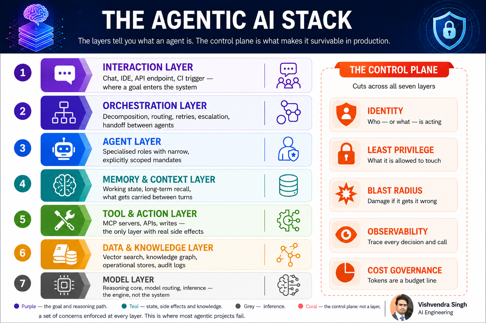

# The Agentic AI Stack & Its Architecture

**The synthesis: seven layers and a control plane that ties every mechanism into one production architecture.**

Every mechanism in modern agentic AI engineering is a real, working part of one of seven layers — plus a control plane of five cross-cutting concerns that isn't a layer at all, but a set of checks enforced at every layer. This is where the whole discipline comes together into one architecture.

*The Agentic AI Stack — seven layers define what an agent is; the control plane is what makes it survivable in production.*

---

## 1. The seven layers, and what's actually running in each one today

### 01 · Interaction Layer
Chat, IDE, API endpoint, CI trigger — where a goal enters the system. This is the surface where the Prompt → Context → Loop → Harness pattern begins. The cutting edge here has moved past single-turn chat: voice-native agent entry points, IDE-embedded agents (Claude Code, Cursor, Copilot Workspace) that trigger off a diff or a failing test, and event-driven entry points where a Slack message, a webhook, or a CI failure — not a human typing — is the "prompt."

### 02 · Orchestration Layer
Decomposition, routing, retries, escalation, handoff between agents — the core jobs of orchestration, coordinating whatever multi-agent topology sits underneath. What's new: **graph-based orchestration** (LangGraph, durable-execution engines like Temporal applied to agents) replacing linear chains, so state and retries survive process crashes; **supervisor/planner-executor patterns** where a lightweight planner model decomposes work and hands sub-tasks to cheaper specialist agents; and emerging **agent-to-agent interoperability protocols** (Google's A2A, Anthropic's Agent Client Protocol) that let orchestration cross vendor and framework boundaries instead of staying locked inside one stack.

### 03 · Agent Layer
Specialised roles with narrow, explicitly scoped mandates — individual agents, each running its own harness. The frontier work here is less about the model and more about **role scoping**: system-prompt-level mandate boundaries, tool allow-lists per role, and explicit "cannot do X" constraints that are enforced structurally, not just requested politely. Reasoning-model-backed agents now also carry **test-time compute budgets** — how long an agent is allowed to "think" before it must act — as a first-class configuration, not an afterthought.

### 04 · Memory & Context Layer
Working state, long-term recall, what gets carried between turns. This layer has matured fastest in the last year: **episodic memory** (what happened in this session), **semantic memory** (durable facts about the user/domain), and **procedural memory** (learned strategies/skills) are now treated as three separate stores with different retention and retrieval rules, rather than one undifferentiated context window. Add to that **context compaction** (summarising or pruning stale turns instead of truncating), **hierarchical/paged context windows**, and memory write-back policies that decide what's worth persisting versus what's session-only.

### 05 · Tool & Action Layer
MCP servers, APIs, writes — the only layer with real side effects. This is where function/tool calling meets the real world through the **Model Context Protocol**, now the de facto standard for tool exposure across vendors, alongside emerging **agentic firewalls** and **tool-call sandboxing** that intercept a proposed action before execution to check it against policy — the practical enforcement point for the control plane's least-privilege and blast-radius principles.

### 06 · Data & Knowledge Layer
Vector search, knowledge graph, operational stores, audit logs. Beyond classic RAG, the current state of the art is **agentic RAG** — retrieval as a tool the agent calls iteratively and re-queries based on what it finds, rather than a single upfront fetch — plus **hybrid retrieval** (dense + sparse + graph traversal) and **GraphRAG**-style knowledge graphs for multi-hop reasoning that flat vector search can't do alone. The fine-tuning-vs-RAG-vs-in-context-learning decision now also includes a fourth option in practice: **long-context stuffing** with modern million-token windows, traded off against retrieval cost and latency.

### 07 · Model Layer
Reasoning core, model routing, inference — the engine, not the system. This layer now includes **model routing/cascades** (cheap model attempts first, escalates to a frontier model only on low confidence), **reasoning models** with adjustable thinking budgets, and **speculative decoding**/**prompt caching** as standard latency and cost levers sitting directly underneath the orchestration layer's retry logic.

---

## 2. Reading the stack top to bottom

A request enters at the Interaction Layer, gets decomposed and routed by the Orchestration Layer, is picked up by one or more specialists at the Agent Layer, each of which draws on the Memory & Context Layer for continuity, reaches into the Tool & Action Layer when it needs to actually do something in the world, pulls from the Data & Knowledge Layer when it needs to know something it wasn't trained on, and ultimately runs on the Model Layer — the raw reasoning engine underneath everything else. The control plane isn't another row at the bottom; it's a set of questions asked at every row, every time.

---

## 3. The control plane, updated for production reality

The five cross-cutting concerns — **identity**, **least privilege**, **blast radius**, **observability**, **cost governance** — are no longer abstract principles; each now has concrete tooling attached to it:

- **Identity**: per-agent service identities (not one shared API key), OAuth-style scoped tokens issued per session, and delegated-identity chains so a downstream tool can tell *which agent, acting on whose behalf* made a call.
- **Least privilege**: tool allow-lists enforced at the MCP gateway layer, read-only-by-default access to data stores, and human-in-the-loop approval gates on any write action above a defined risk threshold.
- **Blast radius**: sandboxed execution environments for code-writing agents, dry-run/simulate modes before any destructive action, and circuit breakers that halt an agent loop after N consecutive failed or suspicious actions.
- **Observability**: full trace-level logging of every decision, tool call, and retrieval — increasingly standardised through OpenTelemetry's GenAI semantic conventions — plus eval harnesses that replay production traces against regression suites before a prompt or model change ships.
- **Cost governance**: token budgets enforced per agent and per session, model-routing rules that downgrade to cheaper models automatically, and real-time spend dashboards treating inference cost as a line item, not a surprise on the monthly bill.

This is also where **prompt-injection defense** now lives in practice: because the Tool & Action Layer is the only layer with real side effects, most emerging agentic security tooling — content filtering on tool outputs, provenance tagging on retrieved data, and "trust but verify" re-checks before high-risk actions — sits at the intersection of the Data & Knowledge Layer, the Tool & Action Layer, and the control plane's least-privilege and blast-radius checks.

---

## 4. Why this matters now

Most agentic AI projects don't fail because the model is weak — they fail because the control plane was never built. A single well-prompted agent looks impressive in a demo; it becomes a production incident when nobody scoped its privileges, nobody capped its blast radius, and nobody was watching the token bill. The seven layers tell you *what* you're building. The control plane is what determines whether it survives contact with production.
